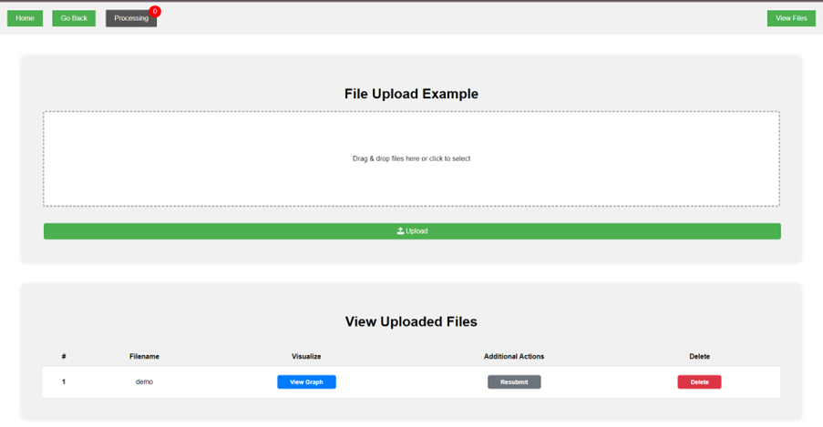
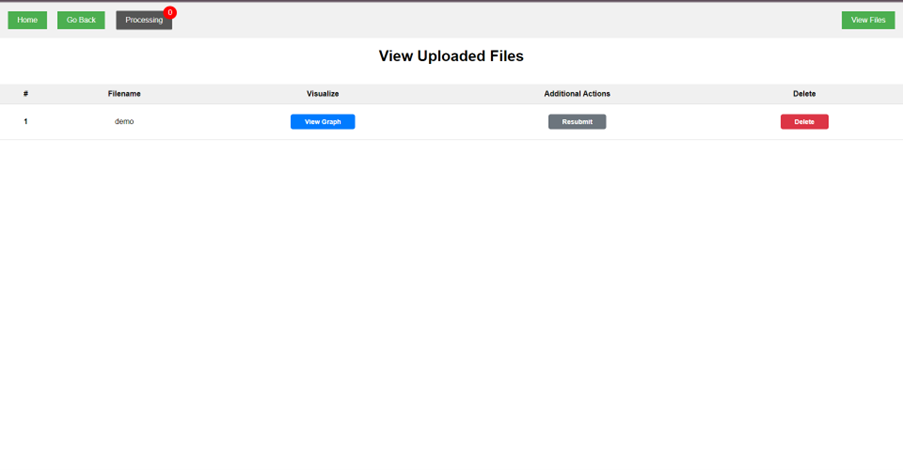
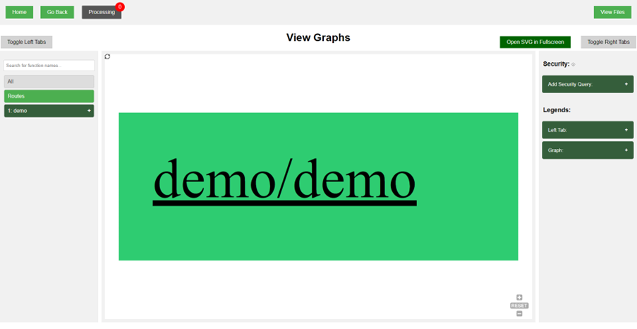
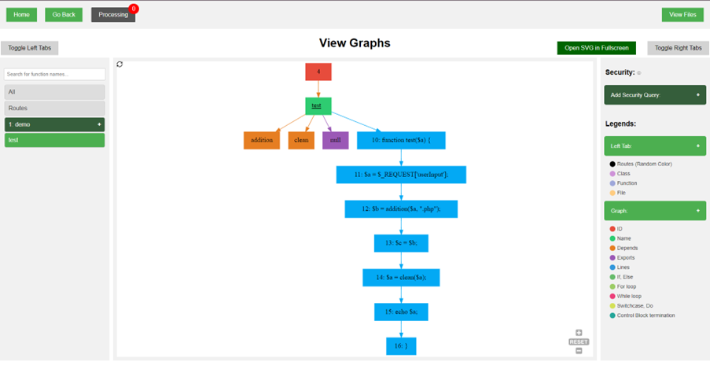
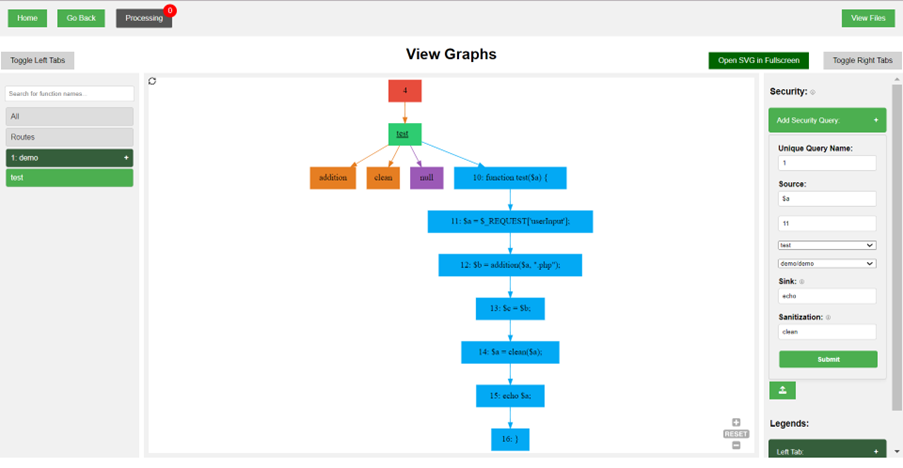
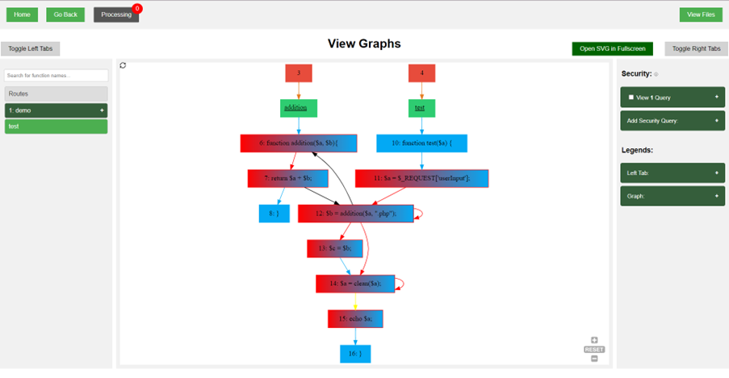

# usage guide

- [graph visualization](##graph-visualization)
- [taint tracking](##taint-tracking)

## graph visualization

### Uploading a folder/file

### View uploaded folder/file

### View the graph

- 3 Main sections of the page (Left, middle, right)
- The left section lists all the files uploaded and the functions created in them
- The middle section displays the graph of the current file that is being selected
- The right section has the security query form to trace variables in the file. Below the form is a legend for the graph

## taint tracking

### Using the security form

- Give your query a unique name (Requried)
- Define the source variable. It can be a variable, function or superglobal (Required)
- State line number of the source variable, or leave it blank to search the entire file
  - Variable requires line number, function and superglobal does not
- Indicate the function name to look into (Required)
- Indicate the file/folder name to look into (Required)
- Provide sink function to stop the trace at a certain function call, or leave blank to keep tracing the variable
- Provide sanitisation functions that are able to sanitized values of the variables

### supported sources
- superglobals (e.g. $_GET)
- specific superglobals (e.g. $_GET['name'])
- variables (e.g. $name)
- function (e.g. rand())

### supported sinks
- list of sinks (e.g. exec,mysql_query,query)
